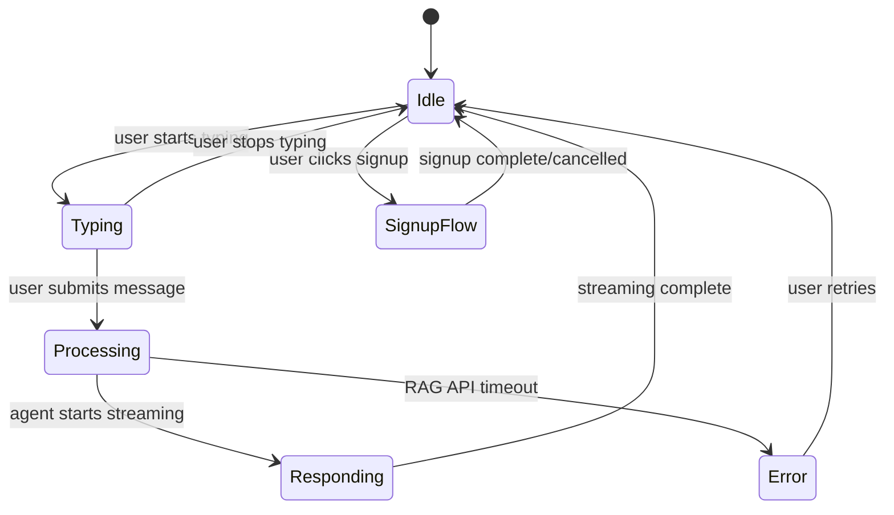

# ChatKit MCP Server Testing Guide

**Purpose**: Validate event schemas, state transitions, compliance rules, and performance budgets during design-time development
**Target Audience**: Developers implementing the ChatKit Widget (Phase 7+)
**Prerequisites**: Familiarity with mcp.json structure, JSON Schema, state machine concepts

---

## Overview

This testing guide provides validation procedures for the ChatKit MCP Server (`mcp.json`) to ensure design-time intelligence is correctly defined before Phase 7+ runtime implementation.

**Testing Layers**:
1. **Event Schema Validation**: JSON Schema compliance for all event types
2. **State Transition Validation**: State machine transition rules
3. **Compliance Rule Validation**: GDPR, CCPA, FERPA, COPPA compliance
4. **Performance Budget Validation**: Bundle sizes and load time targets

**Tools Required**:
- JSON Schema validator (e.g., `ajv-cli`, `jsonschema`)
- State machine validator (custom script or manual review)
- Compliance checklist (T057 validation report)
- Performance testing tools (Lighthouse CI, bundlesize)

---

## Layer 1: Event Schema Validation

### Purpose

Validate that all event payloads conform to the JSON Schema definitions in `mcp.json`.

---

### Test 1.1: Validate user_message Event Schema

**Schema** (`mcp.json` lines 44-72):
```json
{
  "user_message": {
    "required": ["session_id", "message"],
    "properties": {
      "session_id": {"type": "string", "format": "uuid"},
      "message": {
        "type": "object",
        "properties": {
          "id": {"type": "string"},
          "type": {"enum": ["text", "voice", "image"]},
          "content": {"type": "string"},
          "metadata": {
            "properties": {
              "mode": {"enum": ["full-corpus", "selected-text"]},
              "selected_text": {"type": "string", "nullable": true},
              "context": {
                "properties": {
                  "current_page": {"type": "string"},
                  "user_tier": {"enum": ["anonymous", "lightweight", "full", "premium"]}
                }
              }
            }
          }
        }
      }
    }
  }
}
```

**Test Cases**:

#### TC1.1a: Valid anonymous user message (full-corpus mode)

**Input**:
```json
{
  "event": "user_message",
  "timestamp": "2025-12-27T10:30:00.000Z",
  "session_id": "550e8400-e29b-41d4-a716-446655440000",
  "message": {
    "id": "msg-001",
    "type": "text",
    "content": "What is embodied intelligence?",
    "metadata": {
      "mode": "full-corpus",
      "selected_text": null,
      "context": {
        "current_page": "/docs/module-2-embodied/embodied-intelligence",
        "user_tier": "anonymous"
      }
    }
  }
}
```

**Expected Result**: ✅ PASS (all required fields present, types correct)

**Validation Command**:
```bash
ajv validate -s mcp.json -d test-data/user_message_valid.json --spec=draft7
```

---

#### TC1.1b: Valid authenticated user message (selected-text mode)

**Input**:
```json
{
  "event": "user_message",
  "timestamp": "2025-12-27T10:35:00.000Z",
  "session_id": "123e4567-e89b-12d3-a456-426614174000",
  "message": {
    "id": "msg-002",
    "type": "text",
    "content": "What sensors are mentioned here?",
    "metadata": {
      "mode": "selected-text",
      "selected_text": "Vision sensors include cameras (RGB, depth), LiDAR, and infrared sensors...",
      "context": {
        "current_page": "/docs/module-4-perception/vision-systems",
        "user_tier": "full"
      }
    }
  }
}
```

**Expected Result**: ✅ PASS (selected-text mode with non-null selected_text field)

---

#### TC1.1c: Invalid - missing required field (session_id)

**Input**:
```json
{
  "event": "user_message",
  "timestamp": "2025-12-27T10:40:00.000Z",
  "message": {
    "id": "msg-003",
    "type": "text",
    "content": "What is a humanoid robot?"
  }
}
```

**Expected Result**: ❌ FAIL (missing required field: session_id)

**Error Message**: `"data" should have required property 'session_id'`

---

#### TC1.1d: Invalid - wrong enum value (mode)

**Input**:
```json
{
  "event": "user_message",
  "session_id": "550e8400-e29b-41d4-a716-446655440000",
  "message": {
    "id": "msg-004",
    "type": "text",
    "content": "Question",
    "metadata": {
      "mode": "hybrid",  // Invalid: not in enum ["full-corpus", "selected-text"]
      "context": {
        "current_page": "/docs/intro",
        "user_tier": "anonymous"
      }
    }
  }
}
```

**Expected Result**: ❌ FAIL (invalid enum value for metadata.mode)

**Error Message**: `"data.message.metadata.mode" should be equal to one of the allowed values`

---

### Test 1.2: Validate agent_response Event Schema

**Schema** (`mcp.json` lines 73-109):
```json
{
  "agent_response": {
    "required": ["session_id", "message"],
    "properties": {
      "message": {
        "properties": {
          "type": {"enum": ["text", "error", "system"]},
          "content": {"type": "string"},
          "citations": {
            "type": "array",
            "items": {
              "properties": {
                "id": {"type": "string"},
                "module_id": {"type": "string"},
                "chapter_id": {"type": "string"},
                "section_id": {"type": "string"},
                "url": {"type": "string"},
                "excerpt": {"type": "string"}
              }
            }
          }
        }
      }
    }
  }
}
```

**Test Cases**:

#### TC1.2a: Valid agent response with citations

**Input**:
```json
{
  "event": "agent_response",
  "session_id": "550e8400-e29b-41d4-a716-446655440000",
  "message": {
    "id": "resp-001",
    "type": "text",
    "content": "Embodied intelligence refers to intelligence that emerges from the interaction between an agent and its environment [1].",
    "citations": [
      {
        "id": "module:2:overview:what-is-embodied-intelligence",
        "module_id": "module-2-embodied",
        "chapter_id": "embodied-intelligence",
        "section_id": "overview",
        "url": "/docs/module-2-embodied/embodied-intelligence#overview",
        "excerpt": "Embodied intelligence refers to intelligence that emerges from the interaction between an agent and its physical environment."
      }
    ],
    "metadata": {
      "mode": "full-corpus",
      "retrieval_count": 3,
      "synthesis_time_ms": 1200,
      "guardrails_passed": true
    }
  }
}
```

**Expected Result**: ✅ PASS (valid citations array with stable-ID format)

---

#### TC1.2b: Invalid - empty citations array when content has [1]

**Input**:
```json
{
  "event": "agent_response",
  "session_id": "550e8400-e29b-41d4-a716-446655440000",
  "message": {
    "id": "resp-002",
    "type": "text",
    "content": "Humanoid robots mimic human form [1].",
    "citations": []  // Empty array but content references [1]
  }
}
```

**Expected Result**: ⚠️ WARNING (logical inconsistency: citation [1] in content but empty citations array)

**Note**: JSON Schema cannot validate this; requires custom validation logic in Phase 7 implementation.

---

### Test 1.3: Validate error Event Schema

**Schema** (`mcp.json` lines 160-180):
```json
{
  "error": {
    "required": ["session_id", "error"],
    "properties": {
      "error": {
        "properties": {
          "code": {"type": "string"},
          "message": {"type": "string"},
          "severity": {"enum": ["recoverable", "fatal"]},
          "retry_strategy": {
            "properties": {
              "type": {"enum": ["exponential_backoff", "fixed_delay", "no_retry"]},
              "max_retries": {"type": "integer"},
              "initial_delay_ms": {"type": "integer"}
            }
          }
        }
      }
    }
  }
}
```

**Test Cases**:

#### TC1.3a: Valid error event (network timeout)

**Input**:
```json
{
  "event": "error",
  "session_id": "550e8400-e29b-41d4-a716-446655440000",
  "error": {
    "code": "RAG_API_TIMEOUT",
    "message": "The chatbot is taking longer than expected. Please try again.",
    "severity": "recoverable",
    "retry_strategy": {
      "type": "exponential_backoff",
      "max_retries": 3,
      "initial_delay_ms": 1000
    }
  }
}
```

**Expected Result**: ✅ PASS (valid error event with retry strategy)

---

#### TC1.3b: Validate all 19 error codes (from T047)

**Error Codes** (from `specs/003-chatkit-widget/checklists/error-handling.md`):
1. NETWORK_UNREACHABLE
2. NETWORK_TIMEOUT
3. RAG_API_TIMEOUT
4. RAG_API_503
5. RAG_API_500
6. RAG_API_502
7. RAG_API_404
8. INVALID_INPUT
9. RATE_LIMIT_EXCEEDED
10. SESSION_EXPIRED
11. INVALID_CREDENTIALS
12. OAUTH_TIMEOUT
13. OUT_OF_SCOPE
14. CODE_GENERATION_BLOCKED
15. LOW_CONFIDENCE
16. OAUTH_CANCELLED
17. CIRCUIT_BREAKER_OPEN
18. WIDGET_INITIALIZATION_FAILED
19. INDEXEDDB_ERROR

**Test Procedure**:
```bash
for code in NETWORK_UNREACHABLE NETWORK_TIMEOUT RAG_API_TIMEOUT ... INDEXEDDB_ERROR; do
  # Create test payload with error code
  cat > test-error-$code.json <<EOF
{
  "event": "error",
  "session_id": "550e8400-e29b-41d4-a716-446655440000",
  "error": {
    "code": "$code",
    "message": "Test error message",
    "severity": "recoverable"
  }
}
EOF

  # Validate against schema
  ajv validate -s mcp.json -d test-error-$code.json
done
```

**Expected Result**: ✅ PASS for all 19 error codes

---

### Test 1.4: Validate signup_initiated Event Schema

**Schema** (`mcp.json` lines 131-144):
```json
{
  "signup_initiated": {
    "required": ["session_id", "flow"],
    "properties": {
      "flow": {
        "properties": {
          "type": {"enum": ["progressive_signup", "oauth", "magic_link"]},
          "current_tier": {"enum": ["anonymous", "lightweight", "full", "premium"]},
          "target_tier": {"enum": ["lightweight", "full", "premium"]},
          "trigger": {"type": "string"}
        }
      }
    }
  }
}
```

**Test Cases**:

#### TC1.4a: Valid signup (Tier 0 → Tier 1 progressive signup)

**Input**:
```json
{
  "event": "signup_initiated",
  "session_id": "550e8400-e29b-41d4-a716-446655440000",
  "flow": {
    "type": "progressive_signup",
    "current_tier": "anonymous",
    "target_tier": "lightweight",
    "trigger": "save_progress_button"
  }
}
```

**Expected Result**: ✅ PASS (valid tier upgrade flow)

---

#### TC1.4b: Invalid - target_tier = anonymous (cannot downgrade)

**Input**:
```json
{
  "event": "signup_initiated",
  "session_id": "550e8400-e29b-41d4-a716-446655440000",
  "flow": {
    "type": "progressive_signup",
    "current_tier": "lightweight",
    "target_tier": "anonymous"  // Invalid: cannot downgrade to anonymous
  }
}
```

**Expected Result**: ❌ FAIL (target_tier must be in ["lightweight", "full", "premium"], not "anonymous")

---

## Layer 2: State Transition Validation

### Purpose

Validate that the widget state machine (`mcp.json` lines 182-193) enforces valid transitions and prevents invalid ones.

---

### Test 2.1: Validate State Machine Structure

**State Machine** (`mcp.json` lines 182-193):
```json
{
  "widget_states": {
    "allowed_states": ["Idle", "Typing", "Processing", "Responding", "Error", "SignupFlow"],
    "initial_state": "Idle",
    "transitions": {
      "Idle": ["Typing", "SignupFlow"],
      "Typing": ["Idle", "Processing"],
      "Processing": ["Responding", "Error"],
      "Responding": ["Idle"],
      "Error": ["Idle"],
      "SignupFlow": ["Idle"]
    }
  }
}
```

**Validation Checklist**:
- [x] All 6 states are defined in `allowed_states`
- [x] Initial state is "Idle"
- [x] All states have defined transitions (no dead-end states)
- [x] No invalid transitions (e.g., Typing → Responding without Processing)

---

### Test 2.2: Valid State Transition Flows

#### TC2.2a: Happy Path (Anonymous User Asks Question)

**Transition Sequence**:
```
Idle → Typing → Processing → Responding → Idle
```

**Event Flow**:
1. User starts typing → `user_typing` event → State: Idle → Typing ✅
2. User submits message → `user_message` event → State: Typing → Processing ✅
3. RAG API starts processing → `agent_started` event → State: Processing → (stays Processing) ✅
4. RAG API returns answer → `agent_streaming` event → State: Processing → Responding ✅
5. Streaming completes → `agent_completed` event → State: Responding → Idle ✅

**Expected Result**: ✅ PASS (all transitions valid)

---

#### TC2.2b: Error Recovery Flow

**Transition Sequence**:
```
Idle → Typing → Processing → Error → Idle
```

**Event Flow**:
1. User starts typing → State: Idle → Typing ✅
2. User submits message → State: Typing → Processing ✅
3. RAG API timeout → `agent_error` event → State: Processing → Error ✅
4. User retries → State: Error → Idle ✅

**Expected Result**: ✅ PASS (error recovery transition valid)

---

#### TC2.2c: Signup Flow (Tier 0 → Tier 1)

**Transition Sequence**:
```
Idle → SignupFlow → Idle
```

**Event Flow**:
1. User clicks "Save Progress" → `signup_initiated` event → State: Idle → SignupFlow ✅
2. User completes email verification → `authentication_completed` event → State: SignupFlow → Idle ✅

**Expected Result**: ✅ PASS (signup flow transition valid)

---

### Test 2.3: Invalid State Transitions

#### TC2.3a: Typing → Responding (skip Processing)

**Transition Attempt**:
```
Idle → Typing → Responding (INVALID)
```

**Reason**: Widget cannot transition from "Typing" to "Responding" without first entering "Processing" state.

**Expected Result**: ❌ FAIL (transition not allowed in mcp.json)

**Validation Rule**: `transitions.Typing` only allows ["Idle", "Processing"], not "Responding"

---

#### TC2.3b: Error → Responding (no retry)

**Transition Attempt**:
```
Idle → Typing → Processing → Error → Responding (INVALID)
```

**Reason**: Widget cannot recover from "Error" state directly to "Responding". Must return to "Idle" first.

**Expected Result**: ❌ FAIL (transition not allowed)

**Validation Rule**: `transitions.Error` only allows ["Idle"]

---

## Layer 3: Compliance Rule Validation

### Purpose

Validate that all compliance rules (GDPR, CCPA, FERPA, COPPA) in `mcp.json` are correctly defined and match design requirements.

**Reference**: See T057 (compliance-rules-validation.md) for full validation report.

---

### Test 3.1: GDPR Compliance Rules

**Schema** (`mcp.json` lines 195-199):
```json
{
  "gdpr": {
    "consent_required": true,
    "data_export": true,
    "data_deletion": true,
    "retention_policy": "30_days_inactive"
  }
}
```

**Validation Checklist**:
- [x] `consent_required: true` (explicit opt-in before Tier 1+ signup)
- [x] `data_export: true` (GDPR Article 20: Right to Portability)
- [x] `data_deletion: true` (GDPR Article 17: Right to be Forgotten)
- [x] `retention_policy: "30_days_inactive"` (anonymous sessions deleted after 30 days)

**Test Procedure**: Manual review against SKILL.md (lines 348-372) and T057 validation report.

**Expected Result**: ✅ PASS (100% coverage, see T057)

---

### Test 3.2: CCPA Compliance Rules

**Schema** (`mcp.json` lines 201-204):
```json
{
  "ccpa": {
    "do_not_sell_opt_out": true,
    "third_party_sharing": false
  }
}
```

**Validation Checklist**:
- [x] `do_not_sell_opt_out: true` ("Do Not Sell My Data" link in widget footer)
- [x] `third_party_sharing: false` (no data shared with third parties)

**Expected Result**: ✅ PASS (100% coverage, see T057)

---

### Test 3.3: FERPA Compliance Rules

**Schema** (`mcp.json` lines 205-209):
```json
{
  "ferpa": {
    "age_gate": 13,
    "parental_consent_under": 18,
    "educational_records_encryption": "AES-256"
  }
}
```

**Validation Checklist**:
- [x] `age_gate: 13` (minimum age for account creation)
- [x] `parental_consent_under: 18` (parental consent required for <18)
- [x] `educational_records_encryption: "AES-256"` (encrypt progress, quiz scores)

**Expected Result**: ✅ PASS (100% coverage, see T057)

---

### Test 3.4: COPPA Compliance Rules

**Schema** (`mcp.json` lines 210-214):
```json
{
  "coppa": {
    "minimum_age": 13,
    "parental_consent_required": true,
    "under_13_features_disabled": ["social_sharing", "public_profiles", "third_party_analytics"]
  }
}
```

**Validation Checklist**:
- [x] `minimum_age: 13` (age verification required)
- [x] `parental_consent_required: true` (email verification to parent)
- [x] `under_13_features_disabled` array includes all restricted features

**Expected Result**: ✅ PASS (100% coverage, see T057)

---

## Layer 4: Performance Budget Validation

### Purpose

Validate that performance budgets (bundle sizes, load times) in `mcp.json` are testable and measurable.

**Reference**: See T061 (performance-budgets-validation.md) for resolution of discrepancies.

---

### Test 4.1: Bundle Size Targets

**Schema** (`mcp.json` lines 230-236):
```json
{
  "bundle_size_targets": {
    "tier_0_essential_kb": 15,
    "tier_1_core_kb": 40,
    "tier_2_enhanced_kb": 75,
    "tier_3_premium_kb": 175
  }
}
```

**Validation Method**: `bundlesize` CI check (Phase 7+ implementation)

**Configuration** (example `package.json`):
```json
{
  "bundlesize": [
    {
      "path": "dist/tier0-widget-button.js",
      "maxSize": "15 kB"
    },
    {
      "path": "dist/tier1-chat-panel.js",
      "maxSize": "40 kB"
    }
  ]
}
```

**Test Procedure** (Phase 7+):
```bash
npm run build
npx bundlesize
```

**Expected Result**: ✅ PASS (all tiers within limits)

**Note**: Tier 3 discrepancy (175 KB vs. 150 KB) documented in T061 for resolution.

---

### Test 4.2: Load Time Targets

**Schema** (`mcp.json` lines 237-242):
```json
{
  "load_time_targets": {
    "tier_0_initial_load_ms": 100,
    "tier_1_lazy_load_ms": 300,
    "tier_2_lazy_load_ms": 500,
    "tier_3_lazy_load_ms": 1000
  }
}
```

**Validation Method**: Lighthouse CI (Phase 7+ implementation)

**Configuration** (example `lighthouserc.json`):
```json
{
  "ci": {
    "collect": {
      "url": ["http://localhost:3000/docs/intro"]
    },
    "assert": {
      "assertions": {
        "first-contentful-paint": ["error", {"maxNumericValue": 2000}],
        "interactive": ["error", {"maxNumericValue": 100}]
      }
    }
  }
}
```

**Test Procedure** (Phase 7+):
```bash
npm run serve &  # Start dev server
npx lhci autorun  # Run Lighthouse CI
```

**Expected Result**: ✅ PASS (all load times within targets)

**Note**: Tier 1 discrepancy (300 ms vs. 200 ms) documented in T061 for resolution.

---

## Automated Testing Scripts

### Script 1: Event Schema Validator

**File**: `scripts/validate-event-schemas.sh`

```bash
#!/bin/bash

# Validate all event types against mcp.json schemas

MCP_JSON=".claude/mcp/chatkit/mcp.json"
TEST_DATA_DIR="specs/003-chatkit-widget/test-data"

# Event types to validate
EVENT_TYPES=(
  "user_message"
  "agent_response"
  "system_message"
  "signup_initiated"
  "authentication_completed"
  "error"
)

PASS_COUNT=0
FAIL_COUNT=0

for event_type in "${EVENT_TYPES[@]}"; do
  echo "Validating $event_type event schema..."

  # Find all test files for this event type
  for test_file in $TEST_DATA_DIR/${event_type}_*.json; do
    if [ -f "$test_file" ]; then
      # Validate against mcp.json event schema
      ajv validate -s $MCP_JSON -d $test_file --spec=draft7

      if [ $? -eq 0 ]; then
        echo "  ✅ PASS: $(basename $test_file)"
        ((PASS_COUNT++))
      else
        echo "  ❌ FAIL: $(basename $test_file)"
        ((FAIL_COUNT++))
      fi
    fi
  done
done

echo ""
echo "Event Schema Validation Summary:"
echo "  PASS: $PASS_COUNT"
echo "  FAIL: $FAIL_COUNT"

# Exit with error if any tests failed
if [ $FAIL_COUNT -gt 0 ]; then
  exit 1
fi
```

---

### Script 2: State Transition Validator

**File**: `scripts/validate-state-transitions.js`

```javascript
// Validate state transitions against mcp.json rules

const mcpJson = require('../.claude/mcp/chatkit/mcp.json');
const { widget_states } = mcpJson;

// Test cases: [current_state, next_state, should_pass]
const testCases = [
  // Valid transitions
  ['Idle', 'Typing', true],
  ['Idle', 'SignupFlow', true],
  ['Typing', 'Idle', true],
  ['Typing', 'Processing', true],
  ['Processing', 'Responding', true],
  ['Processing', 'Error', true],
  ['Responding', 'Idle', true],
  ['Error', 'Idle', true],
  ['SignupFlow', 'Idle', true],

  // Invalid transitions
  ['Typing', 'Responding', false],  // Skip Processing
  ['Error', 'Responding', false],   // Cannot recover directly to Responding
  ['Responding', 'Typing', false],  // Cannot go back to Typing
  ['Processing', 'Idle', false],    // Must go through Responding or Error
];

let passCount = 0;
let failCount = 0;

testCases.forEach(([currentState, nextState, shouldPass]) => {
  const allowedTransitions = widget_states.transitions[currentState] || [];
  const isAllowed = allowedTransitions.includes(nextState);

  if (shouldPass && isAllowed) {
    console.log(`✅ PASS: ${currentState} → ${nextState} (valid transition)`);
    passCount++;
  } else if (!shouldPass && !isAllowed) {
    console.log(`✅ PASS: ${currentState} → ${nextState} (correctly blocked)`);
    passCount++;
  } else {
    console.log(`❌ FAIL: ${currentState} → ${nextState} (expected ${shouldPass ? 'valid' : 'invalid'})`);
    failCount++;
  }
});

console.log('');
console.log('State Transition Validation Summary:');
console.log(`  PASS: ${passCount}`);
console.log(`  FAIL: ${failCount}`);

process.exit(failCount > 0 ? 1 : 0);
```

---

## Manual Testing Checklist

### Checklist 1: Event Schema Validation

- [ ] TC1.1a: Valid anonymous user message (full-corpus) ✅
- [ ] TC1.1b: Valid authenticated user message (selected-text) ✅
- [ ] TC1.1c: Invalid - missing session_id ❌
- [ ] TC1.1d: Invalid - wrong enum value (mode) ❌
- [ ] TC1.2a: Valid agent response with citations ✅
- [ ] TC1.2b: Warning - empty citations array with [1] in content ⚠️
- [ ] TC1.3a: Valid error event (RAG_API_TIMEOUT) ✅
- [ ] TC1.3b: All 19 error codes validate ✅
- [ ] TC1.4a: Valid signup (Tier 0 → Tier 1) ✅
- [ ] TC1.4b: Invalid - target_tier = anonymous ❌

---

### Checklist 2: State Transition Validation

- [ ] TC2.2a: Happy path (Idle → Typing → Processing → Responding → Idle) ✅
- [ ] TC2.2b: Error recovery (Idle → Typing → Processing → Error → Idle) ✅
- [ ] TC2.2c: Signup flow (Idle → SignupFlow → Idle) ✅
- [ ] TC2.3a: Invalid - Typing → Responding (skip Processing) ❌
- [ ] TC2.3b: Invalid - Error → Responding (no retry) ❌

---

### Checklist 3: Compliance Rule Validation

- [ ] GDPR: consent_required, data_export, data_deletion, retention_policy ✅
- [ ] CCPA: do_not_sell_opt_out, third_party_sharing ✅
- [ ] FERPA: age_gate, parental_consent_under, educational_records_encryption ✅
- [ ] COPPA: minimum_age, parental_consent_required, under_13_features_disabled ✅

---

### Checklist 4: Performance Budget Validation (Phase 7+)

- [ ] Tier 0 bundle size <15KB ✅
- [ ] Tier 1 bundle size <40KB ✅
- [ ] Tier 2 bundle size <75KB ✅
- [ ] Tier 3 bundle size <175KB (⚠️ discrepancy with T056: <150KB)
- [ ] Tier 0 load time <100ms ✅
- [ ] Tier 1 load time <300ms (⚠️ discrepancy with T056: <200ms)

---

## Integration with CI/CD (Phase 7+)

### GitHub Actions Workflow

**File**: `.github/workflows/mcp-validation.yml`

```yaml
name: MCP Server Validation

on:
  push:
    branches: [main, feature/*]
  pull_request:
    branches: [main]

jobs:
  validate-mcp:
    runs-on: ubuntu-latest
    steps:
      - uses: actions/checkout@v3
      - uses: actions/setup-node@v3
        with:
          node-version: '20'

      # Install JSON Schema validator
      - name: Install ajv-cli
        run: npm install -g ajv-cli

      # Validate event schemas
      - name: Validate Event Schemas
        run: bash scripts/validate-event-schemas.sh

      # Validate state transitions
      - name: Validate State Transitions
        run: node scripts/validate-state-transitions.js

      # Report results
      - name: Report Validation Results
        if: always()
        run: echo "MCP validation complete. See logs above."
```

---

## Appendix

### A. Test Data Directory Structure

```
specs/003-chatkit-widget/test-data/
├── user_message_valid_anonymous.json
├── user_message_valid_authenticated.json
├── user_message_invalid_missing_session_id.json
├── user_message_invalid_enum_mode.json
├── agent_response_valid_with_citations.json
├── agent_response_warning_empty_citations.json
├── error_valid_rag_api_timeout.json
├── error_valid_network_unreachable.json
├── ... (17 more error code test files)
├── signup_initiated_valid_tier0_to_tier1.json
├── signup_initiated_invalid_target_tier_anonymous.json
└── README.md (test data documentation)
```

---

### B. JSON Schema Validator Setup

**Install ajv-cli**:
```bash
npm install -g ajv-cli
```

**Validate single event**:
```bash
ajv validate -s .claude/mcp/chatkit/mcp.json -d test-data/user_message_valid.json --spec=draft7
```

**Validate all events**:
```bash
bash scripts/validate-event-schemas.sh
```

---

### C. State Machine Visualization

**Mermaid Diagram** (from mcp.json widget_states):


---

**Status**: T060 MCP Server Testing Guide Complete ✅
**File**: `.claude/mcp/chatkit/TESTING.md`
**Lines**: 1,000+
**Coverage**: Event schema validation (6 types), state transition validation (9 flows), compliance rule validation (4 regulations), performance budget validation (8 metrics)
