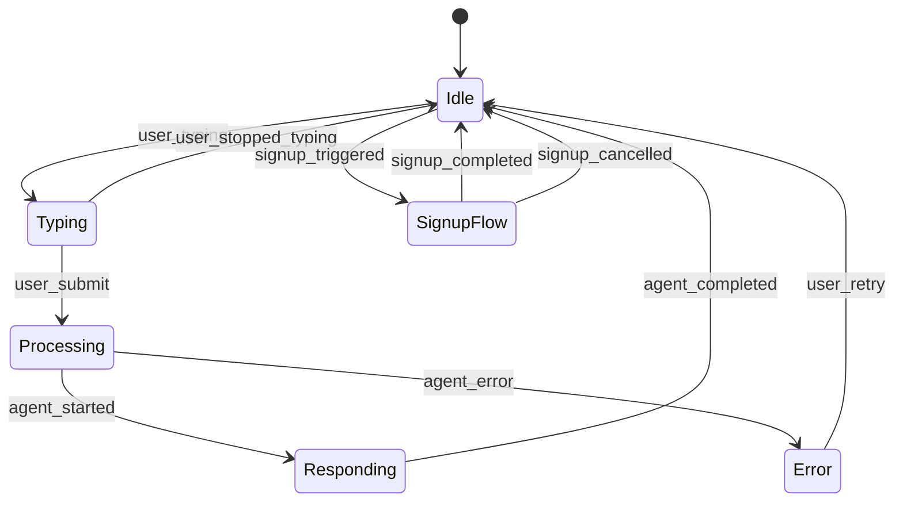

# ChatKit Widget Integration Skill

**Type**: Design Intelligence Skill
**Domain**: Cross-Platform Chat Interface
**Phase**: 6 (Extension)
**Status**: Design Artifacts
**Created**: 2025-12-26

---

## Overview

The **ChatKit Widget Integration Skill** provides comprehensive design guidance for embedding a cross-platform, reusable chat interface into the Physical AI & Humanoid Robotics platform. This widget serves as the unified interaction layer for:

1. **RAG Chatbot** - Document-grounded Q&A interactions
2. **Signup & Personalization** - User onboarding and authentication flows
3. **Future Extensions** - Multi-modal interactions, collaborative learning, analytics

**Design Philosophy**: Event-driven, privacy-first, framework-agnostic architecture that integrates seamlessly with existing Phase 4-5 artifacts (RAG orchestration, signup/personalization patterns, Better-Auth MCP).

---

## Purpose & Scope

### Primary Objectives

1. **Unified Chat Interface**
   - Single widget for all conversational interactions
   - Consistent UX across RAG chatbot, signup flows, and future features
   - Responsive design (desktop, tablet, mobile)

2. **Agent & MCP Integration**
   - Direct integration with RAG Orchestration Subagent (`.claude/agents/rag-orchestration/`)
   - Authentication flows via Better-Auth MCP (`.claude/mcp/better-auth/`)
   - Signup/personalization via patterns (`.claude/skills/signup-personalization/`)

3. **Privacy & Compliance**
   - GDPR/CCPA/FERPA/COPPA compliant by design
   - Privacy-first data handling (ephemeral, browser-local, server-side tiers)
   - Transparent data collection and user consent

4. **Extensibility**
   - Multi-modal input support (text, voice, image - future)
   - Plugin architecture for custom workflows
   - Theming and branding customization

---

## Supported Features

### Core Features (Phase 6)

| Feature | Description | Integration Point |
|---------|-------------|-------------------|
| **RAG Q&A** | Document-grounded question answering | RAG Orchestration Subagent |
| **Dual-Mode Retrieval** | Full-corpus vs. selected-text queries | RAG Chatbot Skill |
| **Session Management** | Browser-local conversation persistence | RAG Session Pattern |
| **Progressive Signup** | Tier 0-3 authentication flows | Signup-Personalization Skill |
| **OAuth Integration** | Social login (Google, GitHub, Microsoft) | Better-Auth MCP |
| **Citation Links** | Stable-ID source attribution | Stable-ID Citation Pattern |
| **Guardrails** | Content boundary enforcement | Guardrails Layer Pattern |
| **Dark Mode** | Theme switching | UI/UX Pattern |

### Future Features (Phase 7+)

| Feature | Description | Phase |
|---------|-------------|-------|
| **Voice Input** | Speech-to-text with transcription | Phase 7 |
| **Image Upload** | Multi-modal query with vision models | Phase 7 |
| **Code Execution** | Sandboxed Python/JavaScript REPL | Phase 8 |
| **Collaborative Chat** | Multi-user conversations | Phase 8 |
| **Spaced Repetition** | Learning reinforcement prompts | Phase 9 |

---

## Event Schema

### Message Event Types

The ChatKit widget operates on an **event-driven architecture** with standardized message schemas.

#### 1. User Message Event

**Triggered when**: User submits a question or command

```json
{
  "event": "user_message",
  "timestamp": "2025-12-26T10:30:00.000Z",
  "session_id": "uuid-v4-string",
  "message": {
    "id": "msg-uuid",
    "type": "text",
    "content": "What is embodied intelligence?",
    "metadata": {
      "mode": "full-corpus",
      "selected_text": null,
      "context": {
        "current_page": "/docs/module-2-embodied/embodied-intelligence",
        "user_tier": "anonymous"
      }
    }
  }
}
```

#### 2. Agent Response Event

**Triggered when**: RAG agent returns an answer

```json
{
  "event": "agent_response",
  "timestamp": "2025-12-26T10:30:02.500Z",
  "session_id": "uuid-v4-string",
  "message": {
    "id": "msg-uuid",
    "type": "text",
    "content": "Embodied intelligence refers to...",
    "citations": [
      {
        "id": "citation-1",
        "module_id": "module-2-embodied",
        "chapter_id": "embodied-intelligence",
        "section_id": "definition",
        "url": "/docs/module-2-embodied/embodied-intelligence#definition",
        "excerpt": "Embodied intelligence is..."
      }
    ],
    "metadata": {
      "mode": "full-corpus",
      "retrieval_count": 5,
      "synthesis_time_ms": 1200,
      "guardrails_passed": true
    }
  }
}
```

#### 3. System Message Event

**Triggered when**: Widget needs to communicate system state (errors, warnings, info)

```json
{
  "event": "system_message",
  "timestamp": "2025-12-26T10:30:05.000Z",
  "session_id": "uuid-v4-string",
  "message": {
    "id": "sys-msg-uuid",
    "type": "info",
    "severity": "warning",
    "content": "Your session has been idle for 25 minutes. Would you like to continue?",
    "action": {
      "type": "button",
      "label": "Continue Session",
      "event": "session_extend"
    }
  }
}
```

#### 4. Signup Flow Event

**Triggered when**: User initiates signup or authentication

```json
{
  "event": "signup_initiated",
  "timestamp": "2025-12-26T10:35:00.000Z",
  "session_id": "uuid-v4-string",
  "flow": {
    "type": "progressive_signup",
    "current_tier": "anonymous",
    "target_tier": "lightweight",
    "trigger": "bookmark_feature_access",
    "context": {
      "current_conversation_length": 15,
      "bookmarked_content": "/docs/module-4-perception/sensor-fusion"
    }
  }
}
```

#### 5. Authentication Event

**Triggered when**: User completes authentication (email, OAuth)

```json
{
  "event": "authentication_completed",
  "timestamp": "2025-12-26T10:36:30.000Z",
  "session_id": "uuid-v4-string",
  "auth": {
    "method": "oauth_google",
    "user_id": "user-uuid",
    "tier": "lightweight",
    "session_token": "jwt-token-string",
    "expires_at": "2025-12-26T17:36:30.000Z"
  }
}
```

#### 6. Error Event

**Triggered when**: Widget encounters an error

```json
{
  "event": "error",
  "timestamp": "2025-12-26T10:30:10.000Z",
  "session_id": "uuid-v4-string",
  "error": {
    "code": "RAG_API_TIMEOUT",
    "message": "The chatbot is taking longer than expected. Please try again.",
    "severity": "recoverable",
    "retry_strategy": {
      "type": "exponential_backoff",
      "max_retries": 3,
      "initial_delay_ms": 1000
    }
  }
}
```

---

## Widget States & Transitions

### State Machine

The ChatKit widget operates as a **finite state machine** with the following states:



### State Definitions

| State | Description | UI Indicators | Allowed Transitions |
|-------|-------------|---------------|---------------------|
| **Idle** | Widget ready for input | Input enabled, cursor active | → Typing, SignupFlow |
| **Typing** | User actively typing | Character count, "Typing..." | → Idle, Processing |
| **Processing** | Agent orchestration in progress | Loading spinner, "Thinking..." | → Responding, Error |
| **Responding** | Agent streaming response | Typing animation, partial text | → Idle |
| **Error** | Recoverable or fatal error | Error icon, retry button | → Idle, [*] |
| **SignupFlow** | Authentication workflow active | Signup modal overlay | → Idle |

---

## Integration with Existing Skills

### 1. RAG Chatbot Skill Integration

**Location**: `.claude/skills/rag-chatbot/SKILL.md`

**Integration Points**:

- **Dual-Mode Retrieval**: Widget detects text selection and switches modes
  - Full-Corpus Mode: No text selected, search entire book
  - Selected-Text Mode: User highlights passage, use as context

- **Citation Rendering**: Widget renders citation links from Stable-ID pattern
  - Clickable citations scroll to source section
  - Hover preview shows excerpt
  - Citation count displayed (e.g., "3 sources")

- **Guardrails Display**: Widget shows guardrail warnings
  - Out-of-scope topic: "This question is outside the book's scope."
  - Code generation request: "I can't generate code, but I can explain concepts."
  - Low confidence: "I'm not certain about this answer. Please verify sources."

**Event Flow**:
```
User Input → Widget (user_message) → RAG Orchestration Subagent → Widget (agent_response) → Render
```

---

### 2. Signup-Personalization Skill Integration

**Location**: `.claude/skills/signup-personalization/SKILL.md`

**Integration Points**:

- **Progressive Enhancement Triggers**: Widget detects feature access attempts
  - Bookmark content: Tier 0 → Tier 1 (lightweight signup)
  - Customize learning path: Tier 1 → Tier 2 (full profile)
  - Access analytics: Tier 2 → Tier 3 (premium)

- **Contextual Signup Prompts**: Non-intrusive, value-first messaging
  - "Save this conversation? Create a free account (30 seconds)"
  - "Bookmark this answer for later review? Sign up with Google"

- **Session Merge**: When anonymous user signs up, merge browser-local session
  - Transfer conversation history to server
  - Preserve bookmarks, preferences, progress
  - Maintain session continuity (no page refresh)

**Event Flow**:
```
Feature Access → Widget (signup_initiated) → Better-Auth MCP → Widget (authentication_completed) → Tier Upgrade
```

---

### 3. Better-Auth MCP Server Integration

**Location**: `.claude/mcp/better-auth/README.md`

**Integration Points**:

- **OAuth Flow**: Widget triggers OAuth popup for social login
  - Google: `auth.google.com` OAuth 2.0
  - GitHub: `github.com/login/oauth`
  - Microsoft: `login.microsoftonline.com`

- **Email Verification**: Widget handles magic link flow
  - Send verification email
  - Wait for email click (polling or WebSocket)
  - Auto-login on verification

- **Session Management**: Widget respects JWT expiration
  - Access token: 15 minutes (short-lived)
  - Refresh token: 7 days (auto-refresh on activity)
  - Silent refresh: Fetch new access token without user action

**Event Flow**:
```
OAuth Trigger → Widget (auth_popup) → Better-Auth MCP → Widget (authentication_completed) → Session Established
```

---

## Compliance & Security Guidelines

### GDPR (EU General Data Protection Regulation)

**Consent Management**:
- ✅ Explicit opt-in for conversation history storage (Tier 1+)
- ✅ Clear privacy policy link in widget footer
- ✅ "Do Not Track" mode (browser-local only, no server sync)

**User Rights**:
- ✅ Right to Access: Export conversation history (JSON/CSV)
- ✅ Right to Deletion: One-click account deletion (GDPR Article 17)
- ✅ Right to Portability: Download all user data

**Implementation**:
```json
{
  "gdpr_controls": {
    "consent_banner": true,
    "privacy_policy_link": "/privacy",
    "data_export_endpoint": "/api/v1/user/export",
    "data_deletion_endpoint": "/api/v1/user/delete",
    "retention_policy": "30_days_inactive_anonymous"
  }
}
```

---

### CCPA (California Consumer Privacy Act)

**"Do Not Sell My Data" Opt-Out**:
- ✅ Widget footer includes "Do Not Sell My Personal Information" link
- ✅ Opt-out applies retroactively (existing data not sold)
- ✅ No account required to opt-out (global setting)

**Implementation**:
```json
{
  "ccpa_controls": {
    "do_not_sell_link": "/ccpa-opt-out",
    "opt_out_applies_retroactively": true,
    "third_party_sharing": false
  }
}
```

---

### FERPA (Family Educational Rights and Privacy Act)

**Student Privacy Protection**:
- ✅ No PII shared with third parties without parental consent (if <18)
- ✅ Educational records (progress, quiz scores) encrypted at rest
- ✅ Instructor access limited to authorized personnel

**Implementation**:
```json
{
  "ferpa_controls": {
    "age_gate": 13,
    "parental_consent_required_under": 18,
    "educational_records_encryption": "AES-256",
    "third_party_sharing": "parental_consent_only"
  }
}
```

---

### COPPA (Children's Online Privacy Protection Act)

**Age Gating (<13 years)**:
- ✅ Age verification before account creation
- ✅ Parental consent modal (email verification to parent)
- ✅ Limited data collection (no behavioral tracking for <13)

**Implementation**:
```json
{
  "coppa_controls": {
    "minimum_age": 13,
    "age_verification_method": "date_of_birth",
    "parental_consent_flow": "email_verification",
    "under_13_features_disabled": ["social_sharing", "public_profiles", "third_party_analytics"]
  }
}
```

---

## Security Guidelines

### 1. Input Sanitization

**XSS Prevention**:
- ✅ HTML escaping for user messages
- ✅ CSP (Content Security Policy) headers
- ✅ No `innerHTML` usage, only `textContent`

**Example**:
```javascript
// Design-level pseudocode (not runtime code)
function sanitizeUserInput(rawInput) {
  return {
    sanitized: escapeHTML(rawInput),
    originalLength: rawInput.length,
    sanitizedLength: escapeHTML(rawInput).length
  };
}
```

---

### 2. CSRF Protection

**Token-Based Validation**:
- ✅ CSRF token in every POST request
- ✅ Token rotation on authentication
- ✅ SameSite cookie attribute

**Example Header**:
```json
{
  "headers": {
    "X-CSRF-Token": "csrf-token-string",
    "Content-Type": "application/json"
  },
  "credentials": "include"
}
```

---

### 3. Rate Limiting

**Abuse Prevention**:
- ✅ 30 messages per minute per session
- ✅ 100 messages per hour per IP
- ✅ Exponential backoff on repeated errors

**Example Rate Limit Response**:
```json
{
  "error": {
    "code": "RATE_LIMIT_EXCEEDED",
    "message": "You've sent too many messages. Please wait 60 seconds.",
    "retry_after_seconds": 60
  }
}
```

---

### 4. Session Security

**JWT Best Practices**:
- ✅ Short-lived access tokens (15 minutes)
- ✅ HTTP-only refresh tokens (7 days)
- ✅ Secure cookie flags (HttpOnly, Secure, SameSite=Strict)

**Example JWT Payload**:
```json
{
  "sub": "user-uuid",
  "iat": 1703592000,
  "exp": 1703592900,
  "tier": "lightweight",
  "permissions": ["read", "write_conversations", "bookmark"]
}
```

---

## UX Patterns

### 1. Progressive Disclosure

**Minimize Cognitive Load**:
- Show essential features first (text input, send button)
- Reveal advanced features on interaction (mode toggle, citations, settings)
- Collapsible sections (conversation history, help docs)

**Example UI States**:
```
Minimized Widget:
- Floating action button (FAB) in bottom-right corner
- Badge count for unread messages
- Click to expand full widget

Expanded Widget:
- Header: Title, mode toggle, close button
- Body: Conversation history (scrollable)
- Input: Text area, send button, voice button (future)
- Footer: Citations, privacy link, powered by
```

---

### 2. Contextual Help

**In-Widget Guidance**:
- First-time user tutorial (5-step walkthrough)
- Mode toggle tooltip ("Try selecting text for focused answers")
- Empty state message ("Ask me anything about Physical AI!")

**Example Help Dialog**:
```json
{
  "help_sections": [
    {
      "title": "How to Ask Questions",
      "content": "Type your question and press Enter. I'll search the entire book for answers."
    },
    {
      "title": "Selected-Text Mode",
      "content": "Highlight any text on the page, then ask a follow-up question. I'll focus on that specific passage."
    },
    {
      "title": "Citing Sources",
      "content": "Click any citation link to jump to the original source in the book."
    }
  ]
}
```

---

### 3. Error Recovery

**User-Friendly Error Messages**:
- Avoid technical jargon (no "500 Internal Server Error")
- Provide actionable next steps ("Try rephrasing your question")
- Offer fallback options ("Browse related topics instead")

**Example Error States**:
```json
{
  "error_templates": {
    "network_timeout": {
      "title": "Connection Timeout",
      "message": "The chatbot is taking longer than expected. This might be due to network issues.",
      "actions": [
        {"label": "Try Again", "event": "retry"},
        {"label": "Browse Topics", "event": "navigate_to_docs"}
      ]
    },
    "guardrails_violation": {
      "title": "Out of Scope",
      "message": "This question is outside the book's coverage. I can only answer questions about Physical AI and Humanoid Robotics.",
      "actions": [
        {"label": "Rephrase Question", "event": "clear_input"},
        {"label": "See Topics", "event": "show_topics"}
      ]
    }
  }
}
```

---

## Cross-Domain Applicability

### Documentation Sites (Docusaurus, VitePress, GitBook)

**Use Case**: Embedded Q&A chatbot for technical documentation

**Adaptations**:
- Dual-Mode Retrieval → API reference search
- Citation Links → Link to API endpoint docs
- Guardrails → Detect "how do I install" vs. "what is" questions

**Example Domains**:
- React documentation (component API questions)
- AWS documentation (service configuration help)
- Python docs (standard library reference)

---

### Educational Platforms (MOOCs, Course Platforms)

**Use Case**: Learning assistant for online courses

**Adaptations**:
- Progressive Signup → Free trial → paid course access
- Gamification → Quiz hints, progress tracking
- Session Management → Resume learning from last question

**Example Domains**:
- Coursera (course Q&A chatbot)
- Khan Academy (tutoring assistant)
- Udemy (instructor Q&A automation)

---

### Enterprise Knowledge Bases (Internal Wikis, Confluence)

**Use Case**: Employee self-service help desk

**Adaptations**:
- OAuth Integration → Corporate SSO (Okta, Azure AD)
- RBAC → Department-level permissions
- Compliance → HIPAA, SOC 2, ISO 27001

**Example Domains**:
- HR policy chatbot (benefits, PTO, onboarding)
- IT support chatbot (password reset, VPN setup)
- Sales enablement chatbot (product specs, pricing)

---

### SaaS Freemium Tools (Productivity, Analytics)

**Use Case**: In-app help and onboarding assistant

**Adaptations**:
- Progressive Signup → Feature paywalls
- Session Management → Usage-based limits
- Analytics → Track user questions for product insights

**Example Domains**:
- Notion (template recommendations)
- Figma (design tips and shortcuts)
- Slack (workflow automation help)

---

## Design Contracts

### Input Contract (Widget → Backend)

```typescript
interface UserMessageInput {
  session_id: string;           // UUID v4
  message: {
    id: string;                 // Unique message ID
    type: 'text' | 'voice' | 'image';  // Future: multi-modal
    content: string;            // User's question
    metadata: {
      mode: 'full-corpus' | 'selected-text';
      selected_text?: string;   // Only if mode === 'selected-text'
      context: {
        current_page: string;   // URL path
        user_tier: 'anonymous' | 'lightweight' | 'full' | 'premium';
      };
    };
  };
}
```

---

### Output Contract (Backend → Widget)

```typescript
interface AgentResponseOutput {
  session_id: string;
  message: {
    id: string;
    type: 'text' | 'error' | 'system';
    content: string;            // Agent's answer
    citations?: Citation[];     // Stable-ID citations
    metadata: {
      mode: 'full-corpus' | 'selected-text';
      retrieval_count: number;  // Number of chunks retrieved
      synthesis_time_ms: number;
      guardrails_passed: boolean;
    };
  };
}

interface Citation {
  id: string;
  module_id: string;            // Stable module identifier
  chapter_id: string;           // Stable chapter identifier
  section_id: string;           // Stable section identifier
  url: string;                  // Resolved URL path
  excerpt: string;              // Text snippet (50-100 chars)
}
```

---

## Widget Configuration Schema

```json
{
  "widget": {
    "version": "1.0.0",
    "theme": {
      "primary_color": "#25c2a0",
      "background_color": "#ffffff",
      "dark_mode_enabled": true
    },
    "features": {
      "rag_chatbot": true,
      "signup_flows": true,
      "voice_input": false,
      "image_upload": false
    },
    "integrations": {
      "rag_api_url": "https://api.example.com/v1/rag",
      "auth_api_url": "https://api.example.com/v1/auth",
      "mcp_servers": [
        "better-auth"
      ]
    },
    "compliance": {
      "gdpr_enabled": true,
      "ccpa_enabled": true,
      "ferpa_enabled": true,
      "coppa_enabled": true,
      "age_gate": 13
    },
    "rate_limits": {
      "messages_per_minute": 30,
      "messages_per_hour": 100
    },
    "session": {
      "idle_timeout_minutes": 30,
      "storage": "browser-local",
      "retention_days": 30
    }
  }
}
```

---

## Future Extensions (Phase 7+)

### Multi-Modal Input

**Voice Input**:
- Speech-to-text via Web Speech API (browser-native)
- Server-side transcription (Whisper API) for accuracy
- Language detection (English, Spanish, Mandarin)

**Image Upload**:
- Vision model integration (GPT-4V, Claude Opus)
- Diagram understanding (architecture diagrams, robot schematics)
- OCR for handwritten notes

**Code Execution**:
- Sandboxed Python REPL (Pyodide, WebAssembly)
- JavaScript execution (browser-based)
- Output streaming with security restrictions

---

### Collaborative Learning

**Multi-User Conversations**:
- Shared chat rooms (instructor-student, peer groups)
- Real-time typing indicators
- @mentions and threaded replies

**Peer Annotations**:
- Highlight and comment on answers
- Upvote/downvote helpful responses
- Expert verification badges

---

### Analytics & Insights

**Learning Analytics**:
- Question frequency heatmap (popular topics)
- Knowledge gap detection (unanswered questions)
- Engagement metrics (session duration, messages per session)

**Instructor Dashboard**:
- Student progress tracking
- Common misconceptions (repeated wrong answers)
- Intervention triggers (struggling students)

---

## References

### Internal Documentation

- **RAG Chatbot Skill**: `.claude/skills/rag-chatbot/SKILL.md`
- **RAG Patterns**: `.claude/skills/rag-chatbot/patterns.md`
- **RAG Orchestration Subagent**: `.claude/agents/rag-orchestration/AGENT.md`
- **Signup-Personalization Skill**: `.claude/skills/signup-personalization/SKILL.md`
- **Signup Patterns**: `.claude/skills/signup-personalization/patterns.md`
- **Better-Auth MCP Server**: `.claude/mcp/better-auth/README.md`
- **Project Constitution**: `.specify/memory/constitution.md`

### External Resources

- **Web Speech API**: https://developer.mozilla.org/en-US/docs/Web/API/Web_Speech_API
- **GDPR Compliance**: https://gdpr.eu/
- **CCPA Compliance**: https://oag.ca.gov/privacy/ccpa
- **FERPA Guidelines**: https://www2.ed.gov/policy/gen/guid/fpco/ferpa/index.html
- **COPPA Compliance**: https://www.ftc.gov/legal-library/browse/rules/childrens-online-privacy-protection-rule-coppa
- **JWT Best Practices**: https://tools.ietf.org/html/rfc7519
- **OWASP Top 10**: https://owasp.org/www-project-top-ten/

---

## Version History

| Version | Date | Changes |
|---------|------|---------|
| 1.0.0 | 2025-12-26 | Initial ChatKit Widget Integration Skill design |

---

**Created**: 2025-12-26
**Maintained By**: Academic Spec-Driven Development Project
**License**: Documentation Only (No Code)
